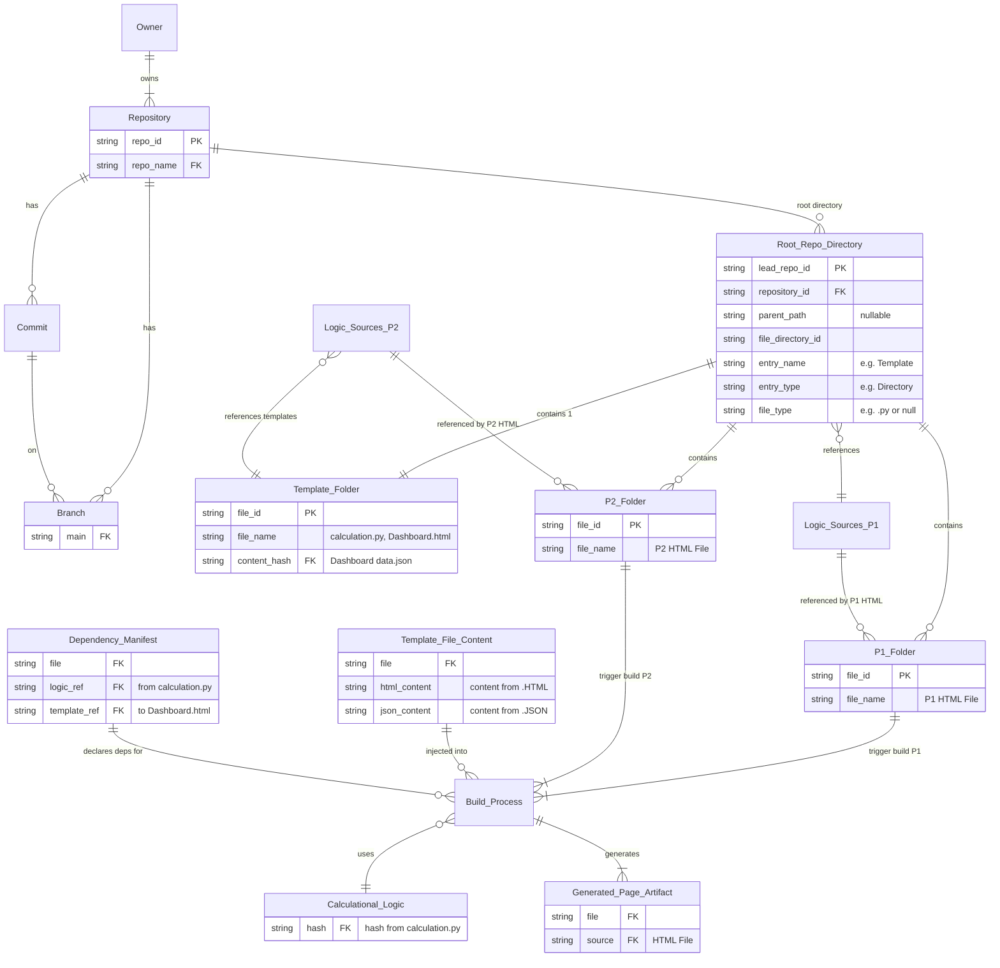

# Detailed and Structural ER Diagram — "Lead Repo" Structure and Build Logic

## Diagram

## Entities

| Entity | Key fields | Notes |
|---|---|---|
| Owner | — | Owns one or more repositories |
| Repository | PK `repo_id`, FK `repo_name` | |
| Commit | — | |
| Branch | FK `main` | |
| Root Repo Directory ("Lead Repo") | PK `lead_repo_id`, FK `repository_id`, `parent_path` (nullable) | Entry rows: `File/Directory_ID`, `Entry_Name` (Template), `Entry_Type` (Directory), `File_Type` (.py / null) |
| Template Folder | PK `File_ID`, `File_Name`, FK `Content_Hash` | Files: `calculation.py`, `Dashboard.html`, `Dashboard data.json` |
| P1 Folder | PK `File_ID`, `File_Name` | P1 HTML File |
| P2 Folder | PK `File_ID`, `File_Name` | P2 HTML File |
| Calculational Logic Sources (P1 / P2) | — | Logic referenced by the P1/P2 HTML files |
| Build Process | — | Core of *Logic Injection and Dependency* |
| Template File Content | FK `File` | Content from .HTML and .JSON |
| Calculational Logic | FK hash | Hash from `calculation.py` |
| Dependency Manifest | FK `File`, FK logic ref, FK template ref | Links `calculation.py` and `Dashboard.html` |
| Generated Page Artifact | FK `File`, FK source | Source: HTML File |

## Build logic

1. A P1 or P2 folder change triggers the **Build Process**.
2. The build references the calculational logic (`calculation.py`, tracked by hash) and the templates in the Template Folder.
3. **Template File Content** (.HTML / .JSON) is injected, and the **Dependency Manifest** declares which logic and template each page depends on.
4. The build outputs a **Generated Page Artifact** per source HTML file.

## Transcription notes

- "Dashboardd" is normalized to "Dashboard". Garbled labels ("logic's from", "template il:to", "sourc:") are rendered as logic ref, template ref and source.
- The right-hand label reads "P1 HTML File references Logic and Templates". It is shown as P2, since that side links to the P2 Folder.
- The hollow-arrow link (Logic Sources → Template Folder) and the "Logic Injection and Dependency" grouping can't be drawn in a Mermaid ER diagram. They appear as a relationship and as the *Build logic* section instead.
